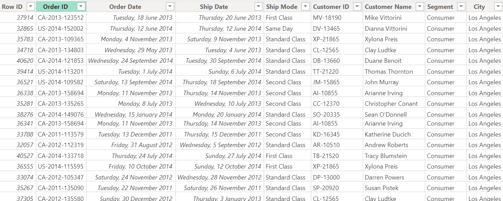

# ANALYSIS AND PERFORMANCE REVIEW OF GLOBAL SUPERSTORES BETWEEN 2011 AND 2014

This is a comprehensive analysis of Global Superstore's performance from 2011 to 2014, aiming to extract meaningful insights that can guide strategic decision-making.

		  

## INTRODUCTION
This report aims to equip both technical and non-technical teams with actionable insights and recommendations to enhance Global Superstores' performance and competitive positioning in the market.
This report delves into key findings, highlighting both technical and non-technical aspects of the business. The objective is to provide a holistic understanding of the company's operations during this period.
For this Analysis Power BI was used, Power Bi is a powerful Business Intelligence Tool, For Data Analysis and Visualization.

   

**_Disclaimer_**: _All datasets and reports is just dummy dataset to demonstrate capabilities of power BI._

## Skills/Concepts Demostrated 
_The following skills were applied:_
- Data cleaning
- Power Query
- Data Modeling
- PivotTable
- Data Visualization
- Knowledge of generating actionable insight
###### _The following Power Bi concepts were incorporated:_
-	Bookmarking, 
-	DAX, Quick Measures, 
-	Page Navigation, 
-	Modelling, 
-	filters, 
-	tool tips

    

 
## Problem Statement:
### _To analyze the dataset and provide answers to the questions listed below._
#### Question 1.
- What are the three countries that generated the highest total profit for Global
Superstore in 2014?
- For each of these three countries, find the three products with the highest total profit.
Specifically, what are the products’ names and the total profit for each product?
#### Question 2.
- Identify the 3 subcategories with the highest average shipping cost in the United States.
#### Question 3.
- Assess Nigeria’s profitability (i.e., total profit) for 2014. How does it compare to other
African countries?
- What factors might be responsible for Nigeria’s poor performance? You might want to
  investigate shipping costs and the average discount as potential root causes.
#### Question 4.
- Identify the product subcategory that is the least profitable in Southeast Asia.
  Note: For this question, we assume that Southeast Asia comprises Cambodia,
  Indonesia, Malaysia, Myanmar (Burma), the Philippines, Singapore, Thailand, and
   Vietnam.
- Is there a specific country i n Southeast Asia where Global Superstore should stop
  offering the subcategory identified in 4a?
#### Question 5.
- Which city is the least profitable (in terms of average profit) in the United States? For
  this analysis, discard the cities with less than 10 Orders.
- Why is this city’s average profit so low?
#### Question 6.
- Which product subcategory has the highest average profit in Australia?
#### Question 7.
- Which customer returned items and what segment do they belong
- Who are the most valuable customers and what do they purchase?

## Table View:

## Power Query

## Manage Relationships

## Modelling

## Data Overview:

The following are the Key Metrics of Global Superstores between 2011 and 2014:

        

        
## FINDINGS/INSIGHTS BY ANALYSIS:

 
 
### Individual Question Analysis:
The three (3) countries that generated the highest total profit for Global Superstore in 2014:

From the Pie Chart Visual, The Three(3) most profitable Countries for Global Super Stores are:
- United States with about $93,510
- India with $48,810
  And
- China with $46,790

### Top 3 Products in the Three (3) most Profitable Countries:

		                

A. **United States:** 
With about $93,510 and 49.45% of the 3 most profitable countries in 2014 has the following as the 3 top products:
- Canon ImageCLASS 2200 Advanced Copier with profit of about $15,680
- Hewlett Packard LaserJet 3310 Copier with profit of about $3,620
- GBC DocuBind TL300 Electric Binding System with profit of about $1,910

B. **India:** 
With about $48,810 and 25.81% of the 3 most profitable countries in 2014 has the following as the 3 top products:
- Sauder Classic Bookcase, Traditional with profit of about $2,400
- Cisco Smart Phone, with Caller ID with profit of about $1,600
- Hamilton Beach Refrigerator, Red with profit of about $1,400

  

C. **China:** 
With about $46,790 and 24.74% of the 3 most profitable countries in 2014 has the following as the 3 top products:
- Sauder Classic Bookcase, Metal with profit of about $1,463
- Bush Classic Bookcase with profit of about $1,220
- HP Copy Machine, Color with profit of about $1,196

### Highest Average Shipping Cost by Subcategory  in the United States

The Following are the Sub-Category of items with the highest Average shipping cost in the United states:
- Chairs with average shipping Cost of $58
- Phones with average shipping Cost of $41
- Storage with average shipping Cost of $27

### Nigeria's Profitability Analysis in 2014:

Nigeria's profit for 2014 is compared to other African countries, this allows for an assessment of Nigeria's performance in the context of the entire African region.
###### The Bottom 3 African Countries are ; 
- Uganda : with loss of $1,000
- Zimbabwe: with loss of $2,000
- Nigeria : with loss of $23,000
###### And the Top 3 African Countries are;
- South Africa: with profit of $9,400
- Morocco: with loss of $8,400
- Egypt : with loss of $6,500
  Nigeria is the least performing country with a great loss  of about $23,000.

### Factors Affecting Nigeria’s Poor Performance

The investigation into Nigeria's poor performance suggests looking at factors such as shipping costs and discounts to understand potential root causes. 
Investigations into Discounts and Shipping Cost of the Bottom 3 African Countries showed:
- Nigeria Topped Discount with $193, and 
- Nigeria is second with Shipping Cost at about $5.5

### Least Profitable Subcategory in Southeast Asia

Tables Topped the Least Profitable Sub-Category in Southeast Asia.
The specific country in Southeast Asia where Global Superstore should consider stopping the identified subcategory (Tables) was determined as follows;
- Indonesia was the least profitable over $10,700 lost in Tables, hence it should be stopped.

### Least Profitable City in the United States

The Bottom 3 Least Profitable cities in the United States with at least 10 orders include:
- Charlotte with a loss of $110
- Toledo with a loss of $117, and 
- Concord being at the bottom of the 3 with a loss of about $1,862
- 
###### Probable factors Influencing the low profitability:
The potential factors contributing to the low profitability include:
- Higher shipping costs,
- Higher Average discounts 
- Low demand,  and
- High competition

### Product Subcategory Analysis in Australia

###### The Product Sub-Category Analysis in Australia Showed The Top 3 As Follows:
- Phones came third with average profit of  about $98
- Copiers came Second with average profit of  about $105, while,
- Appliances came First with average profit of  about $139

### Customer Returns Analysis

Analysis on returns showed Sonia Cooley returned most items and they belonged to the Consumer Segment

### Most Valuable Customers

The Three Most Valuable Customers based on total sales are:

- Hunter Lopez  with Total Purchase of $30,243.57
- Sean Miller with Total Purchase of $35,170.93, and 
- Tom Ashbrook with Total Purchase of $40,488.07
- 
__Their Purchases include:__
- Technology,
- Office Supplies, and
- Furniture

## CONCLUSION AND RECOMMENDATIONS
- _These findings provide a comprehensive understanding of various aspects of Global Superstore's operations, including profitability, product performance, customer behavior, and potential areas for improvement._
- _It would be beneficial for the company to leverage these insights for strategic decision-making and improving the overall business performance.__

### RECOMMENDATIONS
Based on the insights and findings, here are some recommendations for Global Superstores:
- **Focus on Profitable Countries:** Resources should be allocated with more marketing efforts in countries that have consistently 
  shown high total profits, such as the United States, India, and China
- **Discount Strategy:** Reassess the discount strategy, particularly in regions where profitability is a concern. Consider 
  adjusting 
  discount rates to maintain competitiveness without significantly impacting profit margins.
- **Review Least Profitable Subcategories:** Investigate the reasons behind the least profitable product subcategory in Southeast 
  Asia. Determine whether it's a market demand issue or if there are specific challenges in the supply chain. Consider 
  discontinuing 
  the subcategory or refining the product offerings
- **City-specific Strategies:** For the least profitable city in the United States, develop city-specific marketing campaigns or 
  promotions to increase customer engagement. Understand local market dynamics and adjust the product mix accordingly.
- **Product and Marketing Optimization:** Optimize product offerings based on top-performing products in each region. Enhance 
  marketing strategies to promote these products effectively
- **Shipping and Discount Strategy:** Evaluate and optimize shipping costs and discount strategies to balance competitiveness and 
  profitability
- **Customer Segmentation:** Leverage insights on customer segments to tailor marketing and communication strategies. Identify 
  opportunities to offer personalized promotions or loyalty programs to different segments.
- **Customer Relationship Management (CRM):** Strengthen relationships with high-value customers by offering exclusive promotions, 
  personalized services, or loyalty programs. Identify opportunities to upsell or cross-sell products to maximize customer lifetime 
  value.
- **Returns Management:** Implement a robust returns management system. Analyze the reasons for returns and take corrective 
  actions, such as improving product descriptions, ensuring quality control, or enhancing the return process.
- **Continuous Monitoring and Adaptation:** Regularly monitor sales, profit, and customer behavior metrics. Stay adaptable to 
  market changes, emerging trends, and customer preferences. Use data analytics to identify new opportunities and address 
  challenges promptly.

### CONCLUSIONS:
- By implementing the above recommendations, Global Superstore can enhance its overall performance, strengthen customer relationships, and optimize its product and market strategies for sustainable growth. 
- Regular reviews and adjustments based on ongoing analysis will be crucial for staying competitive in the dynamic retail landscape.

## DASBOARD VIEW:
The Following shows different Dashboard Views for Global superstores

